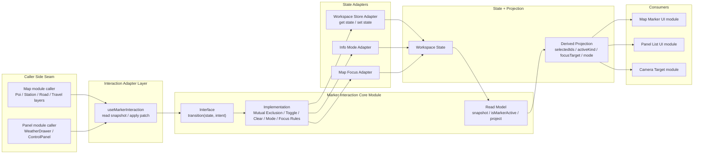
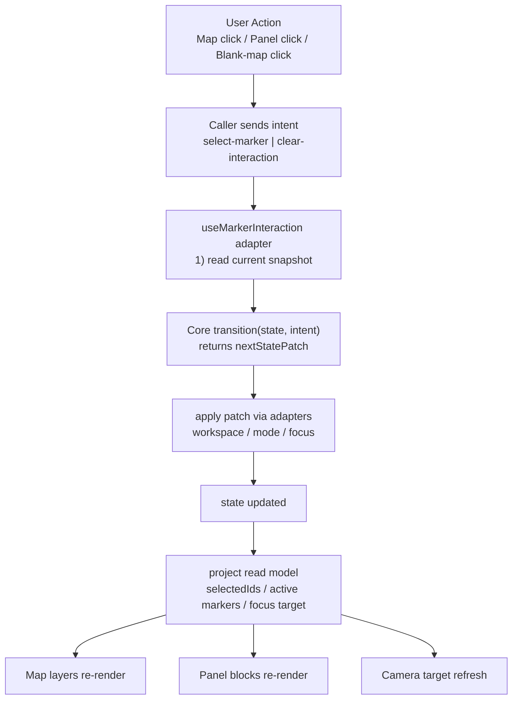

# Phase 3 規劃：深化 Marker Interaction Core

更新日期：2026-08-07  
狀態：進行中（Step 1~2 已完成）

## 最新進度（2026-08-07）

- 狀態：部分完成（Core 分離完成，transition 測試已建立）
- 對應 commit：`92ebf21`
- 已完成：
  - 新增 Marker Interaction Core 純規則入口：`transitionMarkerInteraction`、`createMarkerSelectionSnapshot`、`isMarkerActive`、`projectMarkerInteraction`。
  - `useMarkerInteraction` 降階為 adapter：只做「讀 store -> 呼叫 core -> 寫回 store」。
  - 新增 transition table-driven 測試，鎖定 Phase 2 凍結行為。
- 驗證結果：
  - `node --test --experimental-strip-types src/lib/map/marker-interaction/core.test.ts`：通過
  - `corepack pnpm lint`：通過（0 error，保留既有 1 warning）
  - `curl -s -o /dev/null -w "home:%{http_code}\n" http://localhost:3000/`：`home:200`
  - `corepack pnpm build`：通過

## 背景

Phase 1 與 Phase 2 已完成 map caller / panel caller 的 interaction seam 收斂。  
Phase 3 目標是把更多互動規則從 hook caller 端收回 module implementation，讓 marker interaction module 變成更深的 module，並讓測試以同一個 interface 作為主要 test surface。

參考文件：
- docs/features/map-marker-interaction-refactor-spec.md

## Phase 3 目標

- 把 selection / clear / mode / focus 規則集中到 Marker Interaction Core。
- caller 保持只送 intent，不自行拼接多個 store setter。
- hook 角色收斂為 adapter：讀取 state snapshot、呼叫 core、套用 patch。
- 建立可直接測 transition 的單一測試面，提升故障定位能力。

## In Scope

- Marker interaction 規則內聚（POI / weather / road / travel / clear）。
- blank-map clear 規則留在 interaction module。
- snapshot / isMarkerActive / projection 的 read model 一致化。

## Out of Scope

- MapMarkerTag 視覺與互動動畫重設計。
- CameraRig 動畫曲線調整。
- workspace store 大改版。
- API / schema / data contract 變更。

## 目標架構圖（Phase 3）

## 互動流程圖（Phase 3）

## 實作切分（最小步）

### Step 1：Core 型別與 transition 接口定型

- 新增 core state 與 next state patch 型別。
- 定義 transition(state, intent) 單一入口。
- 不改 caller 行為。

### Step 2：把 dispatch 規則抽到 core

- 將 POI toggle、weather/road/travel 互斥、clear source 規則移入 core。
- hook 保留 adapter 職責。

### Step 3：read model 收斂

- snapshot / isMarkerActive / project 透過同一份 core state 推導。
- caller 停止散落判斷條件。

### Step 4：測試面建立

- 以 transition 為主體的 table-driven 測試。
- 驗證 intent × state 的狀態轉移正確性。

## 驗收條件

- dispatch 內不再有大段互動規則分支。
- 至少四類 marker（poi/weather/road/travel）共用同一套 transition 規則。
- blank-map / panel-close / mode-switch clear 行為可由 core 測試直接覆蓋。
- map 與 panel caller 不再持有 setter choreography。

## 風險與回歸觀察

- 風險 1：POI toggle 規則回歸。  
  對策：先鎖定現行行為測試再搬遷。

- 風險 2：clear source（blank-map vs panel-close/mode-switch）語義漂移。  
  對策：逐條 intent 建立可讀測試案例。

- 風險 3：travel 不切 mode 規則被誤改。  
  對策：加上明確 regression case。
