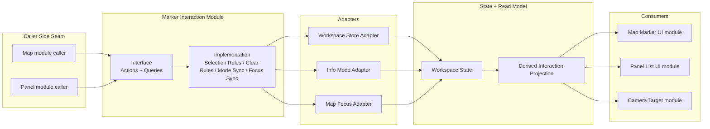
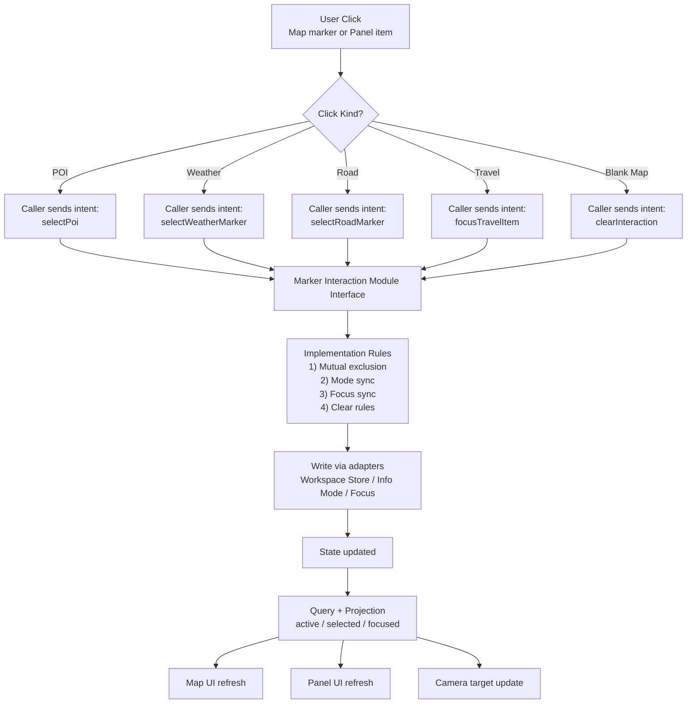

# 功能規格：地圖標記互動 module 重構

## Implementation Status (2026-08-07)

- 狀態：Phase 1、Phase 2 已完成
- 目前成果：已將 map caller 與 panel caller 的標記互動流程收斂到同一個 marker interaction module。
- 本文件用途：記錄已凍結的 interface 與已落地的重構結果，供後續 Phase 3+ 延伸。

## 最終變更摘要（Phase 1 + Phase 2）

### Phase 1（map caller 收斂）

- 已完成項目：
  - 建立 marker interaction module（type、adapter、hook、index 匯出）。
  - map 端 POI / weather / road 點擊流程改為 `dispatch(intent)`。
  - blank-map clear 改為 `clear-interaction` intent（`source = "blank-map"`）。
- 主要變更檔案：
  - `src/lib/map/marker-interaction/types.ts`
  - `src/lib/map/marker-interaction/adapters.ts`
  - `src/lib/map/marker-interaction/use-marker-interaction.ts`
  - `src/lib/map/marker-interaction/index.ts`
  - `src/components/map/MapCanvas.tsx`
  - `src/components/map/poi/usePoiController.ts`
  - `src/components/map/StationLayer.tsx`
  - `src/components/map/RoadLayer.tsx`

### Phase 2（panel caller 收斂）

- 已完成項目：
  - `WeatherDrawer` 由直接操作 store setters 改為 marker interaction dispatch。
  - `ControlPanel` travel 點擊由直接操作 store setters 改為 marker interaction dispatch。
  - panel 關閉與 mode 切換流程接入 `clear-interaction`（`panel-close` / `mode-switch`）。
- 主要變更檔案：
  - `src/panel/feature-blocks/WeatherDrawer.tsx`
  - `src/panel/workspace-panel/ControlPanel.tsx`

### 補充修正（lint 阻塞解除）

- 已完成項目：修復 `map-marker-tag` 的 `setState-in-effect` lint error。
- 主要變更檔案：
  - `src/components/ui/map-marker-tag.tsx`

### 驗證結果

- `get_errors`：通過（本次變更相關檔案）
- `corepack pnpm lint`：通過（0 error，保留 1 個既有 warning：`@next/next/no-img-element`）
- `corepack pnpm build`：通過
- `curl -s -o /dev/null -w "home:%{http_code}\n" http://localhost:3000/`：`home:200`

### 當前狀態與後續

- 已達成：Phase 1、Phase 2 的核心目標（map + panel caller 共用單一 interaction seam）。
- 待進行：Phase 3（把更多清理與投影規則再往 module 內收斂）與後續擴充。

## Problem Statement

目前地圖標記互動不是一個深的 module，而是由多個淺的 module 共同拼出來：

- POI 互動部分集中在 `usePoiController`，但 weather、road、travel 仍各自直接操作 store。
- `MapCanvas` 只負責組裝圖層，但空白點擊清除、mode 切換、互斥選取、map focus 等規則散落在不同 caller。
- `WeatherDrawer`、`ControlPanel`、`RoadLayer`、`StationLayer`、`PoiLayer` 都各自知道一套「點擊某種標記後要清誰、開哪個 mode、鏡頭要不要跟著走」的 implementation 細節。

這代表目前的 interface 太寬。caller 不只是表達「使用者選了某個標記」，而是必須知道：

- 要不要清空 POI focus；
- 要不要清掉 selected station / road；
- 要不要更新 map focus target；
- 要不要切換 info mode；
- 點空白處時要還原哪些狀態。

從 codebase design 的角度，這使得目前的標記互動 module 偏 shallow：刪掉局部 helper，複雜度不會消失，只會回流到更多 caller。結果是 locality 不足，任何互動規則一改，就必須同時追 map layer 與 panel。

## Refactor Goal

建立一個更深的地圖標記互動 module，將「標記被選取、取消選取、互斥清理、mode 切換、map focus 同步」收斂到單一 seam 後面。

重構完成後，caller 應只需要表達：

- 使用者選了哪一類標記；
- 使用者取消了互動；
- 目前有哪些互動狀態需要顯示。

caller 不應再自行拼接多個 store setter 來組出互動流程。

## User Stories

1. As a user, I want clicking a map marker to behave consistently across POI, weather, road, and travel interactions, so that the map feels like one coherent system.
2. As a user, I want blank-map clicks to clear the correct interaction state, so that selection behavior is predictable.
3. As a user, I want panel-triggered marker selection to match map-triggered marker selection, so that switching between panel and map does not feel fragmented.
4. As a user, I want the map to focus on the selected marker using the same rules no matter where the selection originated, so that camera behavior is coherent.
5. As a maintainer, I want marker interaction rules to live behind one seam, so that changes do not require editing multiple callers.
6. As a maintainer, I want the interface of the marker interaction module to be smaller than the total interaction behavior it controls, so that the module gains depth.
7. As a tester, I want to verify selection transitions through one test surface, so that regressions do not require UI-by-UI duplication.
8. As a developer, I want future marker types to plug into the same interaction module, so that new behavior reuses existing leverage rather than adding another custom path.

## Current Friction Inventory

### 1. Selection rules are duplicated across callers

- `RoadLayer` 選取路況時自行處理 `setPoiFocusEnabled(false)`、`selectRoadSegment()`、`setMapFocusTarget()`、`setMode("road")`。
- `StationLayer` 選取測站時自行處理 `setPoiFocusEnabled(false)`、`selectStation()`、`setMapFocusTarget()`、`setMode("weather")`。
- `WeatherDrawer` 從右側面板選取 weather / road / poi 時，也各自重做相同模式的 implementation。
- `ControlPanel` 點擊旅行項目時再手動清 station / road / poi 狀態並更新 focus。

同一組規則被分散在多個 module，代表 interface 沒有形成真正的 seam。

### 2. POI interaction has a partial seam, not a real seam

`usePoiController` 將 POI 選取集中了一部分，這是有價值的方向；但同一層互動語義沒有擴張到其他標記類型，因此目前只有一個 adapter，還不是「兩個以上 adapter 共用同一 interface」的真實 seam。

### 3. The store exposes too much raw choreography

`workspace` store 目前提供多個低階 setter：

- `setActivePoi`
- `setPoiFocusEnabled`
- `selectStation`
- `selectRoadSegment`
- `setMapFocusTarget`
- `setActiveInfoPanelSection`
- `clearPoiFocus`

這些 setter 個別合理，但當 caller 需要知道它們的正確組合順序時，真正的互動 implementation 就外溢到了 seam 之外。

### 4. Blank-click clearing is narrower than the full interaction model

`MapCanvas` 的 `handlePointerMissed` 只明確清 POI / station / road。隨著 travel focus 與更多 marker type 成長，空白點擊規則若繼續留在組裝層，複雜度會持續外擴。

## Solution

引入一個地圖標記互動 module，作為所有標記互動的主要 seam。這個 module 應封裝：

- 選取某類標記時的互斥清理規則；
- 選取後的 info mode 切換規則；
- map focus target 的同步規則；
- 空白點擊時的清除規則；
- 提供 caller 用來判斷 active / selected 狀態的查詢介面。

這個 module 不負責視覺渲染，不直接承擔 `MapMarkerTag` 的 UI 細節，也不處理 `CameraRig` 的動畫 implementation。它的 responsibility 是讓所有 caller 經過同一個 interface 操作互動狀態。

## Proposed Seam

### External seam

對 map layer 與 panel caller 來說，應存在一個共用的 marker interaction seam。caller 只表達意圖，例如：

- 選取一個 POI 標記
- 選取一個 weather 標記
- 選取一個 road 標記
- 聚焦一個 travel item
- 清除目前互動

caller 不應知道內部是怎麼分配到哪些 store 欄位。

### Internal implementation

module 內部可以仍使用現有 workspace store 作為 adapter，但要把 choreography 收進 implementation。這樣可以保留現有 store 架構，同時把 interaction depth 往上拉。

### Real seam criterion

當 map layer caller 與 panel caller 都共用同一個 marker interaction interface 時，這個 seam 才算真正成立，而不是 POI 專用 helper 那種局部 seam。

## 地圖標記互動 module 架構圖



## 使用者點擊時，module 被觸發流程圖



## Interface Direction

這一階段不先定 TypeScript 正式介面，但先明確 interface 方向：

- 一組 action 入口：描述「選取什麼」與「清除什麼」。
- 一組 query 入口：描述「現在哪個標記是 active / selected / focused」。
- 一組 projection：把目前互動狀態轉成 caller 可直接用的派生資訊。

重點不是 methods 數量最少，而是 caller 需要知道的規則最少。若 interface 還要求 caller 傳一大包互斥清理資訊，就代表 module 仍然 shallow。

## Boundaries

### In scope

- POI / weather / road / travel 之間的標記互動規則收斂
- map click / panel click 共用同一組 interaction intent
- blank-map clear 行為收斂
- map focus target 與 info mode 的同步規則收斂

### Out of scope

- `MapMarkerTag` 的視覺重設計
- `CameraRig` 的動畫曲線或 OrbitControls 行為改寫
- workspace store 全面重構
- 新增後端資料來源或改動資料契約

## Affected Modules

- `src/components/map/MapCanvas.tsx`
- `src/components/map/poi/index.ts`
- `src/components/map/poi/usePoiController.ts`
- `src/components/map/poi/PoiLayer.tsx`
- `src/components/map/RoadLayer.tsx`
- `src/components/map/StationLayer.tsx`
- `src/components/map/TravelStopLayer.tsx`
- `src/panel/feature-blocks/WeatherDrawer.tsx`
- `src/panel/workspace-panel/ControlPanel.tsx`
- `src/lib/store/workspace.ts`

可能的鄰接影響：

- `src/app-shell/hooks/useInfoModeState.ts`
- `src/components/map/CameraRig.tsx`

## Interface 規劃草案（Phase 1）

本草案目標是先把 action / query / projection 的 seam 固定，讓 map caller 與 panel caller 都使用同一組 interface，避免直接拼接 store setter。

### Interface 凍結決策（2026-08-06）

本節為 Phase 1 進入實作前的凍結結果，後續若要變更，需以「單一步驟」更新 spec 後再改碼。

#### 決策 A：`clear-interaction` 是否清 `mode`

- 凍結結論：**條件式清 mode**。
  - `source = "blank-map"`：不清 mode（保留目前 info mode）
  - `source = "panel-close" | "mode-switch"`：清 mode（設為 `null`）
- 理由：兼顧現有地圖空白點擊行為與面板關閉語意，降低互動回歸。

替代方案與風險：

- 永遠不清 mode：風險 `中`
  - 面板關閉後仍保留 mode，容易造成 UI 可見狀態與 mode 心智不一致。
- 永遠清 mode：風險 `中`
  - 地圖空白點擊會改變既有操作感，回歸風險較高。

#### 決策 B：`travel` 選取是否切 mode

- 凍結結論：**不切 mode**（維持目前 mode）。
- 理由：travel 是地圖聚焦意圖，不等同切換 weather/road/poi 資訊模式。

替代方案與風險：

- travel 一律切 `poi`：風險 `高`
  - 會把 itinerary 點擊強耦合到 POI 模式，破壞現有資訊流。
- travel 一律切 `weather` 或新增新 mode：風險 `高`
  - 需要額外 UX 定義與大範圍回歸，不符合最小步。

#### 決策 C：`isMarkerActive` 的 id 規格

- 凍結結論：改為 **kind-aware typed input**，不使用單一 `markerId: string`。
- 理由：避免 caller 傳錯 id 類型（例如把 road id 傳給 weather），把錯誤前移到型別層。

替代方案與風險：

- 維持 `markerId: string`：風險 `中`
  - 呼叫簡單，但易發生跨 kind 誤傳，除錯成本高。

### 1) Action 入口（Intent）

```ts
type MarkerKind = "poi" | "weather" | "road" | "travel";

type MarkerInteractionIntent =
  | { type: "select-marker"; kind: "poi"; poiId: string; lon: number; lat: number }
  | {
      type: "select-marker";
      kind: "weather";
      stationId: string;
      lon: number;
      lat: number;
    }
  | {
      type: "select-marker";
      kind: "road";
      roadSegmentId: string;
      lon: number;
      lat: number;
    }
  | {
      type: "select-marker";
      kind: "travel";
      travelItemId: string;
      lon: number;
      lat: number;
    }
  | { type: "clear-interaction"; source: "blank-map" | "panel-close" | "mode-switch" };

type MarkerInteractionActions = {
  dispatch: (intent: MarkerInteractionIntent) => void;
};
```

設計重點：

- caller 只送 intent，不直接呼叫多個 setter。
- interaction module 內部處理互斥清理、mode 同步、focus 同步。
- `clear-interaction` 要支援多來源，統一回到同一個 neutral state。

### 2) Query 入口（Read）

```ts
type MarkerSelectionSnapshot = {
  activeKind: MarkerKind | null;
  activePoiId: string | null;
  activeStationId: string | null;
  activeRoadSegmentId: string | null;
  activeTravelItemId: string | null;
  isPoiFocusEnabled: boolean;
  focusTarget: { lon: number; lat: number } | null;
  activeInfoMode: "poi" | "weather" | "road" | null;
};

type MarkerInteractionQueries = {
  snapshot: () => MarkerSelectionSnapshot;
  isMarkerActive: (
    input:
      | { kind: "poi"; poiId: string }
      | { kind: "weather"; stationId: string }
      | { kind: "road"; roadSegmentId: string }
      | { kind: "travel"; travelItemId: string },
  ) => boolean;
};
```

設計重點：

- map 與 panel 都透過同一份 snapshot 讀狀態。
- 各 caller 的 active 判斷走 `isMarkerActive`，不再各自重寫判斷規則。

### 3) Projection 入口（UI-ready）

```ts
type MarkerInteractionProjection = {
  selectedIds: {
    poiId: string | null;
    stationId: string | null;
    roadSegmentId: string | null;
    travelItemId: string | null;
  };
  mode: "poi" | "weather" | "road" | null;
  focusTarget: { lon: number; lat: number } | null;
  shouldClearPoiFocus: boolean;
};

type MarkerInteractionReadModel = {
  project: () => MarkerInteractionProjection;
};
```

設計重點：

- projection 專門給 UI caller 消費，不把 implementation 細節外露。
- `CameraRig` 只依賴 `focusTarget` 或後續鏡頭 projection，不關心互斥細節。

### 4) 狀態轉移規則（第一版）

| Intent | Required Input | Module Internal Rule | Expected Result |
| --- | --- | --- | --- |
| select-marker / poi | poiId + lon/lat | toggle 同一 POI；清 station/road/travel；mode=poi；focus=poi | POI 成為唯一 active（或 toggle off 回 neutral） |
| select-marker / weather | stationId + lon/lat | 關閉 poi focus；清 poi/road/travel；mode=weather；focus=station | weather 成為唯一 active |
| select-marker / road | roadSegmentId + lon/lat | 關閉 poi focus；清 poi/station/travel；mode=road；focus=road | road 成為唯一 active |
| select-marker / travel | travelItemId + lon/lat | 關閉 poi focus；清 poi/station/road；mode 維持現況；focus=travel | travel 成為唯一 active；不強制切 mode |
| clear-interaction / blank-map | source=blank-map | 清 poi/station/road/travel；關閉 poi focus；focus=null；mode 保留 | 回到 neutral selection state，維持當前 mode |
| clear-interaction / panel-close | source=panel-close | 清 poi/station/road/travel；關閉 poi focus；focus=null；mode=null | 回到 neutral selection state，並關閉 mode |
| clear-interaction / mode-switch | source=mode-switch | 清 poi/station/road/travel；關閉 poi focus；focus=null；mode=null | 回到 neutral selection state，並關閉 mode |

### 5) Marker ID 契約（凍結版）

| Kind | ID 欄位 | 來源規則 |
| --- | --- | --- |
| poi | `poiId` | 使用 POI 原始 `id` |
| weather | `stationId` | 使用地圖/面板統一 station marker id（例如 `station-${index}`） |
| road | `roadSegmentId` | 使用 `segmentId` |
| travel | `travelItemId` | 使用 travel marker 的穩定 `markerId` |

備註：任何 caller 不應自行做 kind 與 id 轉換；若來源資料缺 id，必須在 caller 上游先正規化。

## Migration Plan

建議以最小步遷移，不一次翻整所有 caller。

### Phase 1

先建立 marker interaction module，讓 POI 與 road / weather 至少共用同一個 action seam。

### Phase 2

把 `WeatherDrawer` 與 `ControlPanel` 由直接操作 store 改成呼叫新 interface。

### Phase 3

把 blank-click clear 規則從 `MapCanvas` 組裝層移到 marker interaction module。

### Phase 4

視結果評估是否把 camera destination projection 再往下一層收斂；這一步屬於後續候選，不綁在本次重構內。

## Testing Decisions

- 測試應以 marker interaction module 的 interface 為主要 test surface。
- 優先驗證的行為是：
  - 選取 POI 時，weather / road selection 是否被正確清理；
  - 選取 weather 或 road 時，POI focus 是否被正確解除；
  - panel 觸發與 map 觸發是否得到相同結果；
  - blank-map clear 是否能回到一致的 neutral state；
  - map focus 與 info mode 是否與選取行為保持一致。
- UI 層測試不應重複驗證每個 caller 的內部 setter 細節，而應驗證它們是否透過相同 interface 得到相同行為。

## Success Criteria

- 至少兩種以上標記 caller 共用同一個 marker interaction interface。
- panel caller 與 map caller 不再各自拼裝 interaction choreography。
- blank-click clear 規則不再由 `MapCanvas` 單獨維護完整 implementation。
- 後續新增標記類型時，可以接到同一個 seam，而不需要再複製一套 store setter 組合。
- 與目前使用者可見行為相比，不引入選取、切 mode、focus 的回歸。

## Further Notes

這份 spec 的核心不是把檔案拆更多，而是把互動 implementation 收進更深的 module。若重構後只是把目前重複的 setter 組合搬到另一個 helper 檔，但 caller 仍需要理解大量前提，那就沒有真正提高 depth。